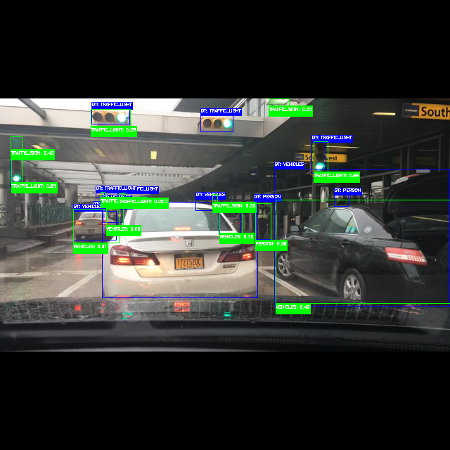
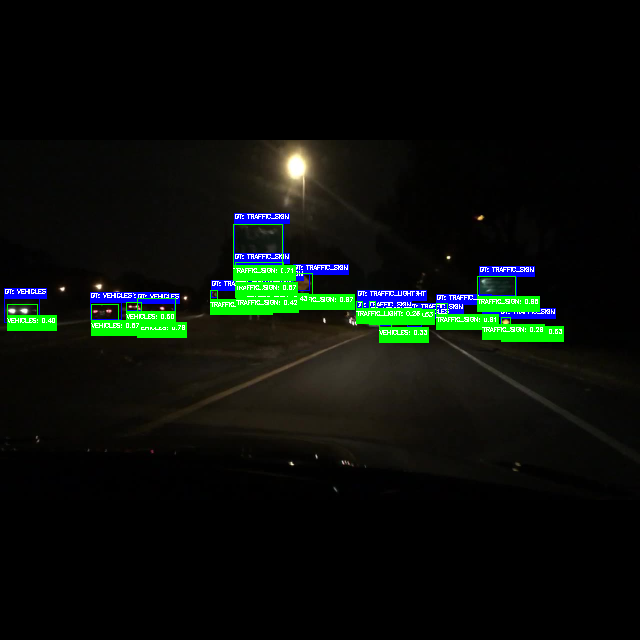
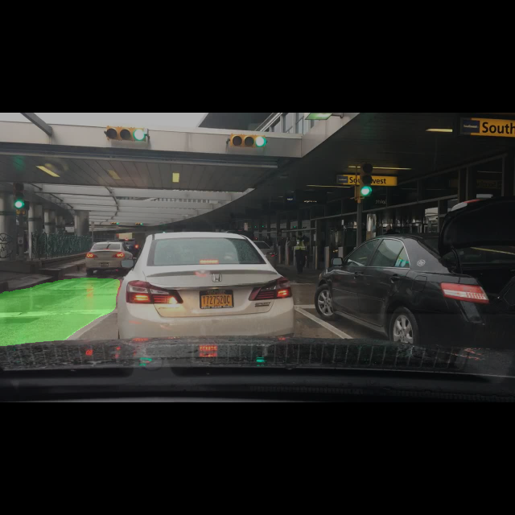
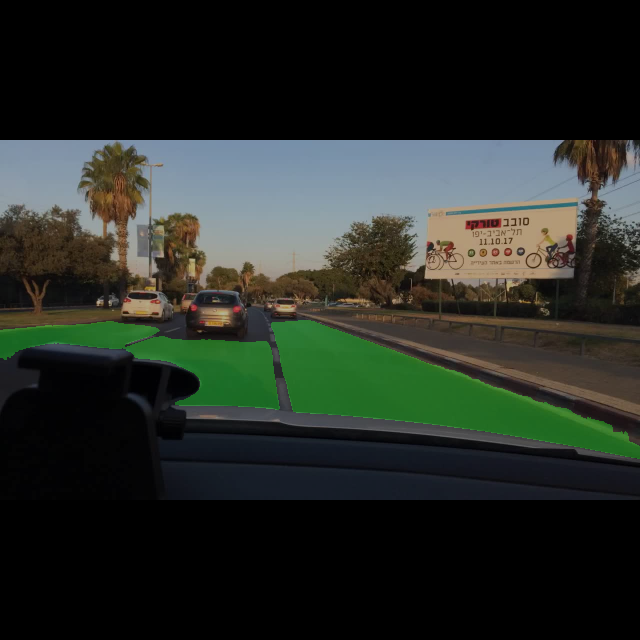

# Panoptic Perception: Multi-Task Learning for Autonomous Driving

A PyTorch implementation of multi-task panoptic perception for autonomous driving, inspired by [YOLOP](https://arxiv.org/abs/2108.11250). This project performs **real-time object detection** and **drivable area segmentation** simultaneously using a shared encoder architecture.


## Example Results

### Object Detection
| | |
|:---:|:---:|
|  |  |

### Drivable Area Segmentation
| | |
|:---:|:---:|
|  |  |

## Highlights

- **Multi-Task Learning**: Joint training for object detection and drivable area segmentation
- **YOLOP-Inspired Architecture**: CSPDarknet backbone + SPP + FPN-PAN neck
- **BDD100K Dataset**: Trained on the large-scale Berkeley DeepDrive dataset
- **Advanced Training Features**:
  - Exponential Moving Average (EMA) for stable training
  - Per-group learning rate scaling for fine-tuning
  - Multi-phase training paradigm (Detection → Segmentation → Joint)
  - Mosaic and MixUp augmentations
- **Multi-GPU Support**: DataParallel training on multiple GPUs

## Results

### Object Detection (BDD100K Validation Set)

| Class | YOLOv8P AP@0.5 | YOLOP AP@0.5 |
|-------|:--------------:|:------------:|
| Person | 0.771 | 0.733 |
| Rider | 0.540 | 0.499 |
| Vehicles | 0.912 | 0.899 |
| Motor | 0.625 | 0.564 |
| Traffic Light | 0.863 | 0.850 |
| Traffic Sign | 0.796 | 0.775 |
| **mAP@0.5** | **0.751** | **0.720** |

### Drivable Area Segmentation

| Metric | Value |
|--------|-------|
| mIoU | **0.917** |
| mDice | **0.955** |
| IoU (Background) | 0.982 |
| IoU (Drivable) | 0.851 |

## Architectures

This project supports two backbone architectures:

### YOLOP (YOLOv5-style) - Current Best

```
Input Image (640x640 or 768x1280)
        │
        ▼
┌───────────────────┐
│   CSPDarknet      │  ← Backbone (Focus + BottleneckCSP Blocks)
│   Backbone        │     Bottleneck: 1×1 → 3×3
└───────────────────┘
        │
        ▼
┌───────────────────┐
│   SPP Module      │  ← Spatial Pyramid Pooling (5, 9, 13)
└───────────────────┘
        │
        ▼
┌───────────────────┐
│   FPN + PAN       │  ← Feature Pyramid Network + Path Aggregation
│   Neck            │
└───────────────────┘
        │
        ├─────────────────────┬─────────────────────┐
        ▼                     ▼                     ▼
┌───────────────┐     ┌───────────────┐     ┌───────────────┐
│  Detection    │     │   Drivable    │     │    Lane       │
│  Head (P3-P5) │     │  Seg Head     │     │  Seg Head     │
└───────────────┘     └───────────────┘     └───────────────┘
```

### YOLOv8P (YOLOv8-style) - Experimental

```
Input Image (640x640 or 768x1280)
        │
        ▼
┌───────────────────┐
│   YOLOv8          │  ← Backbone (Stride-2 Conv + C2F Blocks)
│   Backbone        │     BottleneckV8: 3×3 → 3×3 (richer features)
└───────────────────┘
        │
        ▼
┌───────────────────┐
│   SPPF Module     │  ← Fast SPP (sequential 5×5 maxpool)
└───────────────────┘
        │
        ▼
┌───────────────────┐
│   FPN + PAN       │  ← C2F-based neck
│   Neck (C2F)      │
└───────────────────┘
        │
        ▼
┌───────────────┐
│  Detection    │  ← YOLOv5-style anchor-based head
│  Head (P3-P5) │
└───────────────┘
```

**Key Differences:**
| Feature | YOLOP | YOLOv8P |
|---------|-------|---------|
| Bottleneck | 1×1 → 3×3 | 3×3 → 3×3 |
| Feature Block | BottleneckCSP | C2F (split → chain → concat) |
| Pooling | SPP (parallel) | SPPF (sequential) |
| Memory Usage | Lower | ~2-3× higher |

## Project Structure

```
panoptic_perception/
├── configs/
│   ├── models/
│   │   ├── yolo-detection.cfg           # Detection-only model
│   │   ├── yolo-detection-drivable.cfg  # Detection + Drivable segmentation
│   │   └── yolop.cfg                    # Full YOLOP model
│   └── trainer/
│       ├── train_kwargs.json            # Basic training config
│       └── train_kwargs_optimized.json  # Optimized training config
├── dataset/
│   ├── bdd100k_dataset.py     # BDD100K dataset loader
│   ├── augmentations.py       # Data augmentation pipeline
│   ├── mosaic_augmentation.py # Mosaic augmentation
│   └── enums.py               # Class definitions
├── models/
│   ├── models.py              # YOLOP & YOLOv8P model definitions
│   ├── common.py              # Building blocks (CSP, C2F, SPP, SPPF, Focus, etc.)
│   └── utils.py               # Model utilities
├── trainer/
│   └── trainer.py             # Training loop with EMA, multi-GPU support
├── utils/
│   ├── detection_utils.py     # Detection loss, NMS, IoU calculations
│   ├── evaluation_helper.py   # AP/mAP, IoU metrics
│   ├── logger.py              # Training logger
│   └── wandb_logger.py        # Weights & Biases integration
└── scripts/
    ├── train/train.py         # Training entry point
    ├── eval/eval.py           # Evaluation script
    └── utils/
        └── compute_bdd100k_anchors.py  # Anchor computation via K-means
```

## Installation

```bash
# Clone the repository
git clone https://github.com/yourusername/panoptic-perception.git
cd panoptic-perception

# Create virtual environment
python -m venv venv
source venv/bin/activate  # On Windows: venv\Scripts\activate

# Install dependencies
pip install torch torchvision torchaudio
pip install opencv-python numpy matplotlib tqdm wandb terminaltables
```

## Dataset Setup

1. Download [BDD100K dataset](https://bair.berkeley.edu/blog/2018/05/30/bdd/):
   - Images (100K)
   - Detection labels
   - Drivable area segmentation maps

2. Organize the data:
```
data/
├── 100k/
│   ├── train/
│   └── val/
├── bdd100k_labels/
│   └── det_20/
│       ├── det_train.json
│       └── det_val.json
└── bdd100k_drivable_maps/
    └── labels/
        ├── train/
        └── val/
```

## Training

### Phase 1: Detection Only
```bash
python -m panoptic_perception.scripts.train.train \
    --config panoptic_perception/configs/trainer/train_kwargs_optimized.json
```

### Phase 2: Add Segmentation (Freeze Detection)
Update config to:
- Use `yolo-detection-drivable.cfg`
- Set `detect.trainable: false`
- Set `segmentation.trainable: true`
- Resume from best detection checkpoint

### Phase 3: Joint Fine-tuning
- Unfreeze all heads
- Use lower learning rate (1e-5)
- Enable EMA for stability

## Configuration

### Training Config (`train_kwargs_optimized.json`)

```json
{
    "model_kwargs": {
        "cfg_path": "panoptic_perception/configs/models/yolo-detection-drivable.cfg",
        "device": "cuda"
    },
    "optimizer_kwargs": {
        "_type": "AdamW",
        "initial_lr": 1e-4,
        "weight_decay": 0.01,
        "groups": {
            "backbone": {"group": [0, 23], "trainable": true, "lr_scale": 0.1},
            "detect": {"group": [24], "trainable": true, "lr_scale": 1.0},
            "segmentation": {"group": [25, 33], "trainable": true, "lr_scale": 1.0}
        }
    },
    "trainer_kwargs": {
        "epochs": 100,
        "gradient_clipping": 10.0,
        "use_ema": true,
        "ema_decay": 0.9999
    },
    "loss_weights": {
        "detection": 1.0,
        "drivable_segmentation": 1.0
    }
}
```

### Per-Group Learning Rates

Fine-tune with different learning rates for backbone vs. heads:

```json
"groups": {
    "backbone": {"group": [0, 23], "trainable": true, "lr_scale": 0.01},
    "detect": {"group": [24], "trainable": false},
    "segmentation": {"group": [25, 33], "trainable": true, "lr_scale": 1.0}
}
```

## Key Features

### 1. Multi-Task Loss
```python
loss = detection_loss * w_det + segmentation_loss * w_seg
```

### 2. Detection Loss (YOLOP-aligned)
- **Box Loss**: CIoU loss for bounding box regression
- **Objectness Loss**: BCE with layer-specific balance weights `[4.0, 1.0, 0.4]`
- **Classification Loss**: BCE with optional label smoothing

### 3. Anchor Configuration
Anchors computed via IoU-based K-means on BDD100K:
```
P3 (stride 8):  [[6,11], [11,13], [7,22]]
P4 (stride 16): [[15,22], [13,45], [25,33]]
P5 (stride 32): [[37,57], [71,93], [146,207]]
```

### 4. Exponential Moving Average (EMA)
Maintains a smoothed copy of model weights for stable evaluation:
```python
shadow = decay * shadow + (1 - decay) * weights
```

### 5. Data Augmentation
- Mosaic augmentation (4-image combination)
- MixUp augmentation
- HSV color jittering
- Random horizontal flip
- Affine transformations (rotate, scale, shear, translate)

## Evaluation

```bash
python -m panoptic_perception.scripts.eval.eval \
    --checkpoint path/to/best_model.pt \
    --config panoptic_perception/configs/trainer/train_kwargs_optimized.json
```

## Inference

```python
import torch
from panoptic_perception.models.models import YOLOP

# Load model
model = YOLOP("panoptic_perception/configs/models/yolo-detection-drivable.cfg")
checkpoint = torch.load("best_model.pt", weights_only=False)
model.load_state_dict(checkpoint["model_state"])
model.eval()

# Inference
with torch.no_grad():
    outputs = model(image_tensor)

    # Detection: outputs.detection_predictions
    # Segmentation: outputs.drivable_segmentation_predictions
```

## Training Tips

1. **Start with detection-only** to establish good feature representations
2. **Freeze detection head** when adding segmentation to prevent catastrophic forgetting
3. **Use lower LR for backbone** (0.01x-0.1x) during fine-tuning
4. **Enable EMA** after initial convergence for stability
5. **Monitor both metrics** - detection mAP and segmentation mIoU

## References

- [YOLOP: You Only Look Once for Panoptic Driving Perception](https://arxiv.org/abs/2108.11250)
- [BDD100K: A Diverse Driving Dataset for Heterogeneous Multitask Learning](https://arxiv.org/abs/1805.04687)
- [YOLOv4: Optimal Speed and Accuracy of Object Detection](https://arxiv.org/abs/2004.10934)

## License

This project is licensed under the MIT License - see the [LICENSE](LICENSE) file for details.

## Acknowledgments

- [YOLOP Official Repository](https://github.com/hustvl/YOLOP)
- [BDD100K Dataset](https://www.bdd100k.com/)
- [Ultralytics YOLOv5](https://github.com/ultralytics/yolov5)

## Citation

If you use this code in your research, please cite:

```bibtex
@article{wu2022yolop,
  title={YOLOP: You Only Look Once for Panoptic Driving Perception},
  author={Wu, Dong and Liao, Man-Wen and Zhang, Wei-Tian and Wang, Xing-Gang and others},
  journal={Machine Intelligence Research},
  year={2022}
}
```
