# DENET architecture

Atomic-level forward flow of `DENet` (`net.py`). Renders in any markdown viewer that supports Mermaid (GitHub, VSCode with Mermaid extension, Obsidian, etc.).

## Color legend

| Color | Component | Role |
|---|---|---|
| 🟦 **Blue** | `LapPyramidConv` — decomposition | Frequency analysis (deterministic, no learnable params) |
| 🟧 **Amber** | `TransLow` | Low-frequency / global illumination enhancement |
| 🟨 **Gold** (within Amber) | Multi-scale conv branch | Parallel k=1/3/5/7 ensemble inside TransLow |
| 🟥 **Coral** (within Amber) | `TransGuide` | Generates the initial guide map from the enhanced base |
| 🟩 **Green** | `UpGuide` | Guide propagation — upsamples + refines the control signal |
| 🟪 **Purple** | `TransHigh` | High-frequency / detail enhancement (one per pyramid level) |
| 🟫 **Lilac** (within Purple) | `SFTLayer` | Spatial Feature Transform — modulates detail by the guide |
| 🟦 **Teal** | `LapPyramidConv.pyramid_recons` | Synthesis — rebuilds enhanced image |
| ⬜ **Slate** | Input / Output tensors | Data anchors |

**Visual grouping pattern:** warm hues (amber/gold/coral) for the **what-to-enhance** branch, cool hues (blue/teal) for the **frequency-split machinery**, purple/lilac for the **how-to-amplify-detail** branch, green for the **control signal** linking them.

```mermaid
flowchart TB
    Input[("Input Image<br/>(B, 3, H, W)")]
    Output[("Enhanced Image<br/>(B, 3, H, W)")]

    %% ============ LAPLACIAN PYRAMID DECOMPOSITION ============
    subgraph LapDecom["LapPyramidConv.pyramid_decom (num_high=3)"]
        direction TB
        D_in["x = input"]

        subgraph L0["Level 0  (H × W)"]
            D0_gauss["conv_gauss<br/>reflect-pad + depthwise conv<br/>(5×5 Gaussian, per-channel)"]
            D0_down["downsample x[::2,::2]<br/>→ down₀ (H/2 × W/2)"]
            D0_up["upsample<br/>(zero-insert ×4, conv_gauss)<br/>→ up₀ (H × W)"]
            D0_diff["diff₀ = current − up₀<br/>(B, 3, H, W)"]
            D0_gauss --> D0_down --> D0_up --> D0_diff
        end

        subgraph L1["Level 1  (H/2 × W/2)"]
            D1_gauss["conv_gauss"]
            D1_down["↓2 → down₁ (H/4 × W/4)"]
            D1_up["↑2 → up₁ (H/2 × W/2)"]
            D1_diff["diff₁ = down₀ − up₁"]
            D1_gauss --> D1_down --> D1_up --> D1_diff
        end

        subgraph L2["Level 2  (H/4 × W/4)"]
            D2_gauss["conv_gauss"]
            D2_down["↓2 → down₂ (H/8 × W/8)"]
            D2_up["↑2 → up₂ (H/4 × W/4)"]
            D2_diff["diff₂ = down₁ − up₂"]
            D2_gauss --> D2_down --> D2_up --> D2_diff
        end

        D_in --> D0_gauss
        D0_down -.->|next current| D1_gauss
        D1_down -.->|next current| D2_gauss
        D2_down --> D_base["base = down₂<br/>(B, 3, H/8, W/8)"]
    end

    Input --> D_in

    %% ============ TRANS LOW (BASE) ============
    subgraph TransLow["TransLow  ← pyrs[-1]"]
        direction TB
        TL_in["base (B, 3, H/8, W/8)"]
        TL_enc["encoder:<br/>Conv 3→16, LeakyReLU<br/>Conv 16→64, LeakyReLU<br/>→ x1 (B, 64, H/8, W/8)"]

        subgraph TL_multiscale["Multi-scale branch (parallel)"]
            direction LR
            TL_m1["mm1: Conv1×1<br/>64→16"]
            TL_m2["mm2: Conv3×3<br/>64→16"]
            TL_m3["mm3: Conv5×5<br/>64→16"]
            TL_m4["mm4: Conv7×7<br/>64→16"]
        end

        TL_concat["concat dim=1<br/>(B, 64, H/8, W/8)"]
        TL_dec["decoder:<br/>Conv 64→16, LeakyReLU<br/>Conv 16→3<br/>→ x1' (B, 3, H/8, W/8)"]
        TL_resid["enhanced_base = relu(base + x1')<br/>(B, 3, H/8, W/8)"]

        subgraph TG["TransGuide"]
            direction TB
            TG_cat["concat(base, enhanced_base)<br/>(B, 6, H/8, W/8)"]
            TG_c1["Conv 6→16, LeakyReLU"]
            TG_sa["SpatialAttention(k=3)"]
            TG_c2["Conv 16→3"]
            TG_out["guide₀<br/>(B, 3, H/8, W/8)"]
            TG_cat --> TG_c1 --> TG_sa --> TG_c2 --> TG_out
        end

        TL_in --> TL_enc
        TL_enc --> TL_m1 & TL_m2 & TL_m3 & TL_m4
        TL_m1 & TL_m2 & TL_m3 & TL_m4 --> TL_concat --> TL_dec --> TL_resid
        TL_in --> TG_cat
        TL_resid --> TG_cat
    end

    D_base --> TL_in

    %% ============ TRANS HIGH LEVEL 0 (coarsest detail, H/4 × W/4) ============
    subgraph TH0["UpGuide[0] + TransHigh[0]  ← pyrs[-2] = diff₂"]
        direction TB
        UG0_up["Upsample ×2 (bilinear)"]
        UG0_conv["Conv 3→3 (k=1, no bias)<br/>→ guide₁ (B, 3, H/4, W/4)"]

        subgraph SFT0["SFTLayer"]
            direction TB
            SFT0_enc["encoder: Conv 3→32 + LeakyReLU"]
            SFT0_scale["scale_conv: Conv 3→32 (from guide)"]
            SFT0_shift["shift_conv: Conv 3→32 (from guide)"]
            SFT0_mod["x_enc + x_enc * scale + shift<br/>(B, 32, H/4, W/4)"]
            SFT0_dec["decoder: Conv 32→3<br/>→ sft_out (B, 3, H/4, W/4)"]
            SFT0_enc --> SFT0_mod
            SFT0_scale --> SFT0_mod
            SFT0_shift --> SFT0_mod
            SFT0_mod --> SFT0_dec
        end

        TH0_resid["trans_pyr₂ = diff₂ + sft_out<br/>(B, 3, H/4, W/4)"]

        UG0_up --> UG0_conv
    end

    D2_diff -->|diff₂| SFT0_enc
    UG0_conv -->|guide₁| SFT0_scale
    UG0_conv -->|guide₁| SFT0_shift
    SFT0_dec --> TH0_resid
    D2_diff -.->|residual add| TH0_resid
    TG_out -->|guide₀| UG0_up

    %% ============ TRANS HIGH LEVEL 1 (H/2 × W/2) ============
    subgraph TH1["UpGuide[1] + TransHigh[1]  ← pyrs[-3] = diff₁"]
        direction TB
        UG1["UpGuide: ↑2 + Conv 3→3<br/>→ guide₂ (B, 3, H/2, W/2)"]
        SFT1["SFTLayer:<br/>enc(diff₁) → modulate with guide₂ → dec<br/>→ sft_out (B, 3, H/2, W/2)"]
        TH1_resid["trans_pyr₁ = diff₁ + sft_out"]
        UG1 --> SFT1 --> TH1_resid
    end

    UG0_conv -->|guide₁| UG1
    D1_diff -->|diff₁| SFT1
    D1_diff -.->|residual add| TH1_resid

    %% ============ TRANS HIGH LEVEL 2 (finest detail, H × W) ============
    subgraph TH2["UpGuide[2] + TransHigh[2]  ← pyrs[-4] = diff₀"]
        direction TB
        UG2["UpGuide: ↑2 + Conv 3→3<br/>→ guide₃ (B, 3, H, W)"]
        SFT2["SFTLayer:<br/>enc(diff₀) → modulate with guide₃ → dec<br/>→ sft_out (B, 3, H, W)"]
        TH2_resid["trans_pyr₀ = diff₀ + sft_out"]
        UG2 --> SFT2 --> TH2_resid
    end

    UG1 -->|guide₂| UG2
    D0_diff -->|diff₀| SFT2
    D0_diff -.->|residual add| TH2_resid

    %% ============ PYRAMID RECONSTRUCTION ============
    subgraph LapRecon["LapPyramidConv.pyramid_recons"]
        direction TB
        R_in["trans_pyrs = [enhanced_base, trans_pyr₂, trans_pyr₁, trans_pyr₀]<br/>(coarse → fine)"]
        R0["x = enhanced_base (H/8 × W/8)"]
        R1["up = upsample(x) (H/4 × W/4)<br/>x = up + trans_pyr₂"]
        R2["up = upsample(x) (H/2 × W/2)<br/>x = up + trans_pyr₁"]
        R3["up = upsample(x) (H × W)<br/>x = up + trans_pyr₀"]
        R0 --> R1 --> R2 --> R3
    end

    TL_resid --> R_in
    TH0_resid --> R_in
    TH1_resid --> R_in
    TH2_resid --> R_in
    R_in --> R0
    R3 --> Output

    %% ============ STYLING ============
    %% Color mapping (mind-map style):
    %%   BLUE   = frequency decomposition (analysis, math)
    %%   AMBER  = low-frequency enhancement (illumination, warmth)
    %%   GOLD   = multi-scale conv ensemble (sub-block of amber)
    %%   ORANGE = guide generation (TransGuide, sub-block of amber)
    %%   GREEN  = guide propagation (signal flowing down levels)
    %%   PURPLE = high-frequency enhancement (detail, texture)
    %%   LILAC  = SFT modulation (sub-block of purple)
    %%   TEAL   = synthesis / reconstruction
    %%   SLATE  = input/output tensors (data anchors)

    classDef pyramid       fill:#BBDEFB,stroke:#0D47A1,stroke-width:2px,color:#0D47A1
    classDef pyramidLevel  fill:#E3F2FD,stroke:#1565C0,stroke-width:1px,color:#0D47A1

    classDef transLow      fill:#FFE0B2,stroke:#E65100,stroke-width:2px,color:#BF360C
    classDef multiscale    fill:#FFCC80,stroke:#EF6C00,stroke-width:1px,color:#BF360C
    classDef transGuide    fill:#FFCCBC,stroke:#D84315,stroke-width:1px,color:#BF360C

    classDef guideProp     fill:#C8E6C9,stroke:#2E7D32,stroke-width:2px,color:#1B5E20

    classDef transHigh     fill:#E1BEE7,stroke:#6A1B9A,stroke-width:2px,color:#4A148C
    classDef sft           fill:#F3E5F5,stroke:#8E24AA,stroke-width:1px,color:#4A148C

    classDef recon         fill:#B2DFDB,stroke:#00695C,stroke-width:2px,color:#004D40

    classDef tensor        fill:#ECEFF1,stroke:#37474F,stroke-width:2px,color:#212121,font-style:italic

    %% Decomposition (analysis side)
    class LapDecom pyramid
    class L0,L1,L2 pyramidLevel

    %% Low-frequency branch
    class TransLow transLow
    class TL_multiscale multiscale
    class TG transGuide

    %% High-frequency branches (one class per level for the outer container)
    class TH0,TH1,TH2 transHigh
    class SFT0 sft

    %% Reconstruction
    class LapRecon recon

    %% Data anchors
    class Input,Output,D_base tensor
```

## How to read

- **Solid arrows** = tensor flow forward
- **Dotted arrows** = residual / skip / "becomes next current"
- **Subgraphs** = logical modules (`LapPyramidConv`, `TransLow`, etc.)
- **Tensor shapes** annotated at every junction so dim flow is verifiable

## Key flow points

1. **Decomposition** runs `num_high=3` iterations, producing `diff₀ (H), diff₁ (H/2), diff₂ (H/4)` + `base (H/8)`. Each `diff_i = current_i − upsample(downsample(current_i))` — a Laplacian residual.

2. **TransLow consumes only `base`** (smallest tensor) — global tone/illumination work happens at coarse resolution. Its multi-scale conv branch (k=1/3/5/7 parallel → concat) lets a small spatial receptive field at H/8 cover effectively large image regions.

3. **Guide propagation is cumulative**: `guide₀` (H/8) → upsampled to `guide₁` (H/4) → `guide₂` (H/2) → `guide₃` (H). Each `UpGuide` block adds one bilinear×2 + a 1×1 conv refinement. The guide carries the global enhancement decision down to per-pixel resolution.

4. **SFT modulation** is the key per-level operation: `x' = encoder(x) + encoder(x) * scale(guide) + shift(guide)` then `decoder`. The guide controls *how much* and *in what direction* each level's high-frequency content is amplified — different from a static residual.

5. **Reconstruction** walks the pyramid coarse→fine, upsampling at each step and adding the corresponding transformed Laplacian residual. Inverse of decomposition.

## Architectural insight

One slow global decision (TransLow on `base`) cascades through three fast local edits (TransHigh on each `diff_i`), controlled by a single guide that's progressively refined. Cheap at the bottom, scales up.
